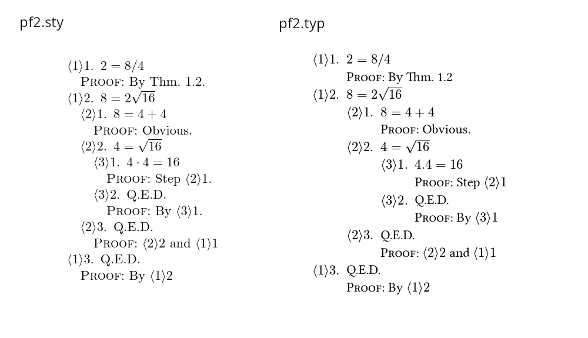

# `pf2`

This is a port of Lamport's structured proof style (pf2) in [typst](https://typst.app/docs/reference/syntax/). The goals of this project are to enable writing short, concise proofs with minimal interaction with external tools.

**Typst**

```typ
#blk[
    + $2 = 8\/4$ <r0> \
      #pf By Thm. 1.2
    + $8 = 2 sqrt(16)$
        + $8 = 4 + 4$ <r1> \
          #pf Obvious.
        + $4 = sqrt(16)$
            + $4 . 4 = 16$ \
              #pf Step @r1
            + #qed \
              #pf By #prev(1)
        + #qed \
          #pf #prev(1) and @r0
    + #qed \
      #pf By #prev(1)
]
```

**TeX**

```tex
\begin{proof}
\step{1}{$2 = 8/4$}
    \begin{proof}
    \pf\ By Thm.\ 1.2.
    \end{proof}
\step{1a}{$8 = 2\sqrt{16}$}
    \begin{proof}
    \step{1-1}{$8=4+4$}
        \begin{proof}
        \pf\ Obvious.
        \end{proof}
    \step{1-2}{$4=\sqrt{16}$}
        \begin{proof}
        \step{1-2-a}{$4\cdot4=16$}
            \begin{proof}
            \pf\ Step \stepref{1-1}.
            \end{proof}
        \qedstep
            \begin{proof}
            \pf\ By \stepref{1-2-a}.
            \end{proof}
    \end{proof}
    \qedstep
        \begin{proof}
        \pf\ \stepref{1-2} and \stepref{1}
        \end{proof}
    \end{proof}
\qedstep
    \begin{proof}
    \pf\ By \stepref{1a}
    \end{proof}
\end{proof}
```



#### Getting started

Copy the [pf2.typ](./pf2.typ) file into your project, along with [example.typ](./example.typ). Run `typst compile example.typ`.

[Typst syntax reference](https://typst.app/docs/reference/syntax/)

#### License

[AGPL](./LICENSE)

#### Inspired by

- [Lamport's pf2.sty](http://lamport.azurewebsites.net/latex/latex.html)
- [pf2.sty documentation](http://lamport.azurewebsites.net/latex/pf2.pdf)
- [maxwell-thum/typst-pf3](https://github.com/maxwell-thum/typst-pf3)
